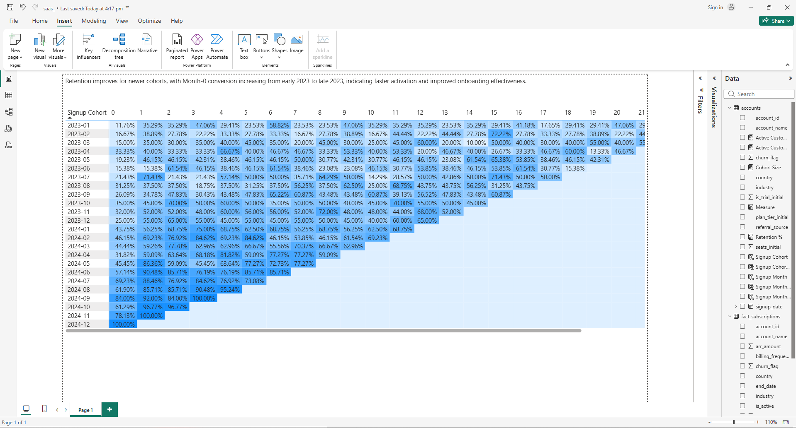

# SaaS Cohort Retention & Activation Analysis (Power BI)

## Overview
This project performs cohort-based retention analysis for a SaaS product to understand customer activation timing and long-term engagement trends.

Customers are grouped by signup month and tracked across lifecycle months to measure retention behavior.

## Business Questions
- How many customers activate in their signup month?
- How does retention change across cohorts over time?
- Are newer cohorts activating faster than older cohorts?

## Tools & Technologies
- Power BI (DAX, data modeling, cohort heatmap)
- SQL (SQLite)
- GitHub (documentation)

## Key Outputs
- Cohort heatmap: Signup Cohort × Months Since Signup
- Retention curve (optional)
- KPI cards (Month-0 activation, 1M/3M/6M retention)

## Files
- `powerbi/` → PBIX dashboard
- `screenshots/` → dashboard images
- `sql/` → SQL scripts (optional)

## Screenshot

